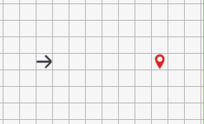
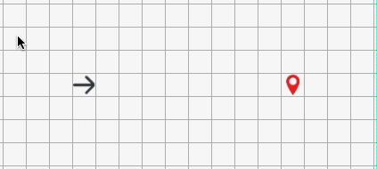
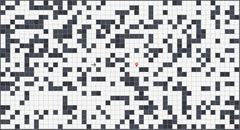

<div align="center">
  
</div>

## Background and Overview
[**PathNavigator**](https://pramirez23.github.io/PathNavigator/) is a pathfinding algorithm visualizer that uses **BFS and DFS** *(Dijkstra's algorithm coming soon!)* to find the shortest path between nodes in a graph. It was built to help people more easily see and understand the steps that different pathfinding algorithms take to find a target.

## Technologies
- JavaScript
- Sass (SCSS)
- Webpack

## Features
Users are able to:
  - Select a pathfinding algorithm and visualization speed
    <div align="center">
      
    </div>

    <br />

  - Move the start and target nodes anywhere on the graph    
    <div align="center">
      
    </div>

    <br />

  - Draw or randomly generate walls on the graph around a root and target node
    <div align="center">
      
    </div>

    <br />
    
    <div align="center">
      
    </div>

    <br />

  - Visualize pathfinding algorithms
    <div align="center">
      
    </div>

## Code Snippets
The function shown below is executed by the root node whenever a new visualization is initiated. It evaluates all of the nodes in the grid and creates parent and child relationships for all of the direct neighbors of each node. The generated tree data structure is what a selected algorithm will search through to find the target node.

Note that a *queue* and a *set* were utilized to make sure each node was evaluated one at a time, while keeping track of nodes that have already been evaluated.

```javascript
generateTree() {
  let nodeQueue = [this];
  let nodes = new Set();
  nodes.add(this.pos.join("-"));
  
  while (!!nodeQueue.length) {
    let node = nodeQueue.shift(); 
    
    Node.MOVES.forEach(move => {
      let dx = move[0];
      let dy = move[1];
      
      let nextPos = [node.pos[0] + dx, node.pos[1] + dy];
      let nextPosX = nextPos[0];
      let nextPosY = nextPos[1];
      
      if (node.board.validMove(nextPos)) {
        let neighbor = this.grid[nextPosX][nextPosY].node;
        
        if (nodes.has(`${nextPosX}-${nextPosY}`)) {
          return;
        }
        
        nodes.add(nextPos.join("-"));
        neighbor.addParent(node);
        nodeQueue.push(neighbor);
      }
    })
  }
}

Node.MOVES = [
  [0, 1],
  [1, 0],
  [0, -1],
  [-1, 0]
]
```
The visualization of the search was made possible by taking advantage of JavaScript's DOM manipulation and asynchronicity. The root node object keeps a record of node positions that have already been searched.

`visualizeSearch()` and `visualizePath()` both iterate through searched and path tiles, while also recursively calling `setTimeout()`. This was done in order to asynchronously change the searched and path tile classes for animation purposes, while also preventing all of the tiles from changing classes at once. Recursion ensures a slight delay between each iteration of animating a searched or path tile.

```javascript
visualizeSearch(root, grid, path, speed) {
  if (root.searched.length === 0) {
    this.visualizePath(root, grid, path);
  } else if (root.searched.length > 0) {      
    setTimeout(() => {
      let pos = root.searched.shift();
      let tile = grid[pos[0]][pos[1]].tileEle;
      tile.classList.add("searched");
      this.visualizeSearch(root, grid, path, speed);
    }, speed);
  }
}

visualizePath(root, grid, path) {
  if (path.length === 0) {
    root.board.algorithmStarted = false;
  } else if (path.length > 0) {
    let pos = path.shift();
    let tile = grid[pos[0]][pos[1]].tileEle;
    setTimeout(() => {
      tile.classList.remove("searched");
      tile.classList.add("path");
      this.visualizePath(root, grid, path)
    }, 30)
  }
}
```
