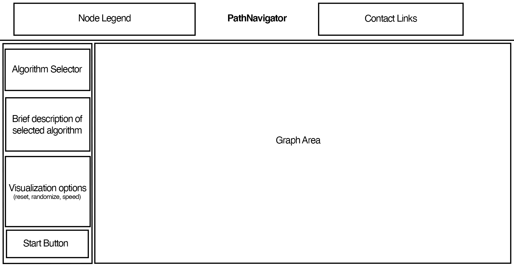

# PathNavigator

## Background and Overview
PathNavigator is a pathfinding algorithm visualizer that uses BFS, DFS, and Dijkstra's algorithm to find the shortest path between nodes in a graph.

## Functionality and MVPs
Users will be able to:
  - Select a pathfinding algorithm
  - Select the speed of the algorithm
  - Draw or randomly generate walls on the graph around a root and target node
  - Move the start and target nodes anywhere on the graph

## Wireframe

  

## Architecture and Technology
  - HTML
  - CSS
  - JavaScript

## Implementation Timeline
  - Day 1
    - Research pathfinding algorithms, how to make graph area
    - Create graph object
  
  - Day 2
    - Implement algorithms 
    - Add ability to "draw" on graph
    - Create node objects
    
  - Day 3
    - Attach node objects to graph
    - Style graph and animations for each step of pathfinding algorithm
    
  - Day 4
    - Add ability for user to adjust speed of algorithm, randomly generate walls, and resetting the graph
    
  - Day 5
    - Continue styling, bug fixes 
    - Implement tutorial modal
    
## Bonus Features
  - Timer for algorithm runtime
